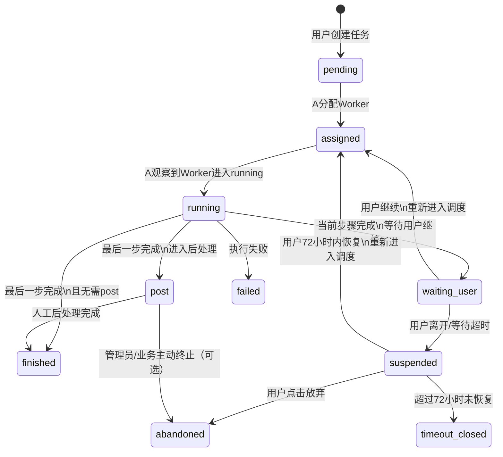
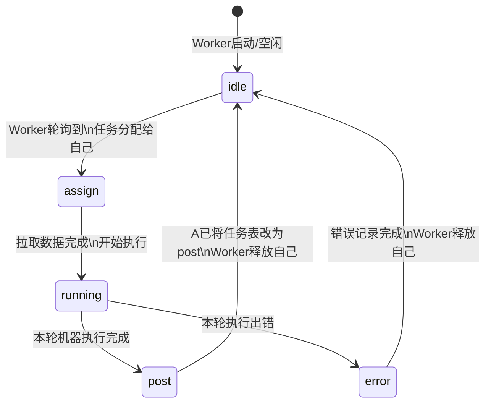

# 任务调度算法说明 v3（含状态图）

## 1. 文档目标

本文档用于说明任务网站中的调度算法设计。  
目标不是描述代码实现细节，而是明确：

- 系统由谁负责什么
- 两张核心表如何分工
- 任务与设备的状态机如何流转
- 单步任务、分步任务、人工后处理任务如何运行
- 用户离开、恢复、放弃时如何处理
- 异常如何归类与记录
- 典型业务场景下，动作顺序是什么

---

## 2. 系统角色

系统中有两类核心角色：

### 2.1 A级主机
A 级主机是调度中心，负责：

- 接收前端创建的任务
- 写入任务表
- 读取设备表
- 选择合适的 Worker
- 在任务表中给任务分配 Worker
- 推进任务状态
- 处理等待用户、挂起、恢复、post、完成、关闭等业务流程
- 记录后台报警日志

### 2.2 Worker
Worker 是执行机，负责：

- 在设备表中维护自己的状态
- 上报自己当前支持的任务类型
- 轮询任务表，寻找分配给自己的任务
- 拉取任务输入和工作空间
- 执行任务
- 在设备表中写入当前执行进度状态

---

## 3. 核心设计原则

### 原则 1：任务表由 A 写，Worker 只读
- A 负责写任务表
- Worker 只读取任务表，不直接修改任务表状态

### 原则 2：设备表由 Worker 写，A 只读
- 每个 Worker 只写自己的设备行
- A 只读取设备表，用来判断设备当前状态

### 原则 3：一个 Worker 一次只处理一个任务
- 不做单 Worker 多任务并发
- 一个设备状态只对应一个当前任务

### 原则 4：调度采用 FCFS 为主
- 当前版本按先来先服务执行
- 后续可扩展优先级或插队机制
- 当前版本先不实现复杂排序调度

### 原则 5：等待用户时，不占用 Worker
- 机器做完当前步骤后
- 如果需要等用户确认或补充输入
- 则释放 Worker
- 任务进入等待用户或挂起状态
- 后续可由任意兼容 Worker 继续执行

### 原则 6：分步任务，对外是一个任务，对内是多个步骤
- 用户视角：一个任务
- 系统视角：这个任务内部有 step 1、step 2、step 3
- 每一步之间可能穿插用户等待和恢复

---

## 4. 核心数据结构

### 4.1 设备表（Device Table）

设备表用于记录所有合法 Worker 的设备状态。

#### 设备表至少应包含的逻辑信息
- `worker_id`
- `worker_name`
- `supported_task_types`
- `status`
- `current_task_id`
- `heartbeat_at`
- 其他环境信息（可选）

#### 设备表写入规则
- Worker 写自己的这一行
- A 只读

#### 设备表作用
A 通过设备表判断：
- 哪些 Worker 当前空闲
- 哪些 Worker 支持某种任务
- 哪些 Worker 已接单
- 哪些 Worker 正在运行
- 哪些 Worker 已经进入 post

### 4.2 任务表（Task Table）

任务表用于记录用户提交的任务及其生命周期状态。

#### 任务表至少应包含的逻辑信息
- `task_id`
- `user_id`
- `task_type`
- `status`
- `assigned_worker_id`
- `step_index`
- `step_total`
- `workspace_uri`
- `input_payload`
- `output_payload`
- `created_at`
- `updated_at`
- `keep_until`
- 其他业务字段（可选）

#### 任务表写入规则
- 由 A 统一写
- Worker 只读

---

## 5. 状态机设计总览

系统包含两套状态机：

- **任务状态机**：由 A 维护，写入任务表
- **设备状态机**：由 Worker 维护，写入设备表

这两套状态机必须分开理解，不能混用。

---

## 6. 任务状态机

### 6.1 任务状态定义

#### `pending`
任务已创建，等待调度

#### `assigned`
A 已将任务分配给某个 Worker，但 Worker 尚未开始执行

#### `running`
任务正在执行

#### `waiting_user`
当前步骤已完成，等待用户下一步确认或输入

#### `suspended`
等待用户超时或用户中途离开，任务挂起，但保留工作空间

#### `post`
机器执行已结束，任务进入人工后处理阶段

#### `finished`
任务全部完成

#### `failed`
任务执行失败

#### `abandoned`
用户主动放弃任务

#### `timeout_closed`
超过保留期限仍未恢复，系统自动关闭任务

### 6.2 任务状态图

### 6.3 任务状态说明

这张状态图表达的是**业务生命周期**：

- `pending -> assigned -> running` 是机器执行前半段
- `running -> waiting_user / post / finished / failed` 是执行结果分叉
- `waiting_user / suspended` 是分步任务中的用户等待过程
- `post -> finished` 是人工后处理闭环
- `suspended -> assigned` 表示任务恢复后重新进入调度，不要求必须由原 Worker 继续执行

---

## 7. 设备状态机

### 7.1 设备状态定义

#### `idle`
空闲，可接任务

#### `assign`
Worker 已看到分配给自己的任务，正在准备执行

#### `running`
Worker 正在执行任务

#### `post`
Worker 已完成本轮机器处理

#### `error`
Worker 本轮执行出错

### 7.2 设备状态图

### 7.3 设备状态说明

这张状态图表达的是**Worker 自己的执行过程**：

- `idle -> assign`：Worker 发现任务已分配给自己
- `assign -> running`：Worker 完成准备动作并开始执行
- `running -> post`：机器执行完成
- `post -> idle`：A 已看到设备 `post`，并已将任务表状态改为 `post`，此时 Worker 可以释放
- `running -> error -> idle`：本轮执行失败后，设备回到可接单状态

---

## 8. 任务状态机与设备状态机的配合关系

两套状态机有明确的协作顺序：

1. A 先在任务表中把任务改为 `assigned`
2. Worker 轮询到任务属于自己
3. Worker 在设备表中把自己改为 `assign`
4. Worker 真正启动后，在设备表中改为 `running`
5. A 读取到设备表中的 `running`
6. A 再把任务表中的任务改为 `running`
7. Worker 完成后把设备表改为 `post`
8. A 读取到设备 `post`
9. A 把任务表改为 `post` 或 `finished`
10. Worker 再把自己改回 `idle`

也就是说：

- **任务表是业务主线**
- **设备表是执行副线**
- A 根据设备表观察结果，推进任务表状态
- Worker 不直接写任务表

---

## 9. 调度策略

当前版本的调度策略为：

### FCFS + 能力匹配 + 空闲设备分配

具体规则：

1. A 扫描任务表中待调度任务
2. 按创建顺序处理
3. 对每个任务，查找设备表中：
   - 状态为 `idle`
   - 且支持该任务类型的 Worker
4. 选中一个 Worker
5. A 在任务表中写入 `assigned_worker_id`
6. A 将任务状态改为 `assigned`
7. Worker 自己轮询任务表，发现被分配给自己后开始执行流程

---

## 10. 标准动作流程

### 10.1 用户提交任务

#### 动作顺序
1. 用户在前端创建任务
2. A 生成 `task_id`
3. A 初始化任务记录
4. A 将任务写入任务表
5. 任务状态设为 `pending`

#### 结果
任务进入等待调度状态。

### 10.2 A 分配任务

#### 动作顺序
1. A 扫描任务表中的 `pending` 任务
2. A 读取任务类型
3. A 读取设备表
4. A 找到一个支持该任务类型且状态为 `idle` 的 Worker
5. A 在任务表中写入 `assigned_worker_id`
6. A 将任务状态改为 `assigned`

#### 结果
任务已被分配，但尚未真正开始运行。

### 10.3 Worker 接单并启动

#### 动作顺序
1. Worker 轮询任务表
2. 发现某条任务 `assigned_worker_id == 自己`
3. Worker 在设备表中把自己状态改为 `assign`
4. Worker 写入自己的 `current_task_id`
5. Worker 拉取输入数据与 workspace
6. Worker 开始执行
7. Worker 在设备表中把状态改为 `running`
8. A 看到该 Worker 已进入 `running`
9. A 把任务表中的状态改为 `running`

#### 结果
任务正式进入执行阶段。

### 10.4 Worker 完成本轮机器执行

#### 动作顺序
1. Worker 执行结束
2. Worker 上传结果或中间结果
3. Worker 在设备表中把状态改为 `post`
4. A 读取到 Worker 进入 `post`
5. A 将任务表中的任务状态改为 `post` 或后续业务状态
6. 此时 Worker 可以把自己改回 `idle`

#### 结果
机器资源被释放，任务进入 post 阶段或等待后续业务动作。

---

## 11. 人工后处理（Post）

`post` 表示机器执行结束，但业务还没结束。

### 特点
- 不再占用 Worker
- 可以进入管理员人工处理
- 管理员可调整结果、补充内容、重新上传结果
- 人工确认完成后，A 将任务状态改为 `finished`

---

## 12. 分步任务设计

分步任务的本质是：

**一个任务，包含多个步骤，中间可能多次等待用户。**

例如：

- 第一步：机器处理
- 等用户确认
- 第二步：再处理
- 再等用户确认
- 第三步：最终处理

---

## 13. 用户离开页面与恢复机制

### 13.1 核心规则

如果用户离开网页，之后再次登录并重新进入该页面：

- 如果距离原任务挂起时间未超过 72 小时
- 系统要主动提示：

> 之前的任务还没有完成，是否继续？

用户有两个选择：

#### 继续
- 恢复该任务
- 使用原 workspace
- 任务继续执行后续步骤

#### 放弃
- 将任务改为 `abandoned`
- 删除 workspace

### 13.2 恢复入口规则

当用户再次进入该页面时，前端或 A 需要检查：

- 当前用户是否存在未完成任务
- 该任务是否属于当前页面/当前业务
- 是否仍在 72 小时保留期内

如果满足条件，就弹恢复提示。

---

## 14. Workspace 保留规则

### 规则
- 对等待用户、挂起、post、异常中断等未彻底结束的任务
- 系统保留其 workspace 72 小时
- 超过 72 小时未恢复，系统可自动关闭任务并清理 workspace

### 用户主动放弃
- 一旦用户点击“放弃”
- 任务状态改为 `abandoned`
- 立即删除 workspace

---

## 15. 异常归类

异常统一归纳为两大类：

### 15.1 连接类异常
本质是：

**某个时刻系统怀疑设备连接状态不正常。**

例如：
- 心跳异常
- 握手失败
- Worker 长时间无更新

#### 当前版本策略
- 只报警
- 不自动恢复
- 不自动重派
- 不引入复杂断线补偿逻辑

### 15.2 业务类异常
本质是：

**任务流程没有正常闭环。**

例如：
- 用户长时间不继续
- 用户主动放弃
- Worker 执行失败
- Post 长时间未处理
- Workspace 超过保留期

#### 当前版本策略
- 由状态机表达
- 保留 workspace 72 小时
- 需要时记录后台报警日志

---

## 16. 报警机制

当前版本的报警采用后台报警日志。

### 报警日志可记录的信息
- 报警时间
- 报警类型
- `worker_id`
- `task_id`
- 当前状态
- 报警描述
- 是否已处理
- 备注

### 当前版本不做
- 不做短信报警
- 不做邮件报警
- 不做 IM 推送
- 先只做后台日志

---

## 17. 当前版本明确不做的内容

为了控制系统复杂度，当前版本明确不做以下内容：

1. 不做接单超时回收
2. 不做掉线后自动重派
3. 不做 running 中断后的自动恢复
4. 不做复杂断线补偿
5. 不做一个 Worker 多任务并发
6. 不做复杂优先级调度

这些属于后续版本可扩展能力。

---

## 18. 典型场景示例

### 场景 1：普通单步任务，自动完成

#### 场景说明
用户提交一个普通任务，任务只需要机器执行一次，不需要人工后处理。

#### 动作顺序
1. 用户提交任务
2. A 创建任务记录，状态为 `pending`
3. A 找到空闲且支持该任务类型的 Worker
4. A 将任务分配给该 Worker，任务状态改为 `assigned`
5. Worker 轮询到任务属于自己
6. Worker 把设备状态改为 `assign`
7. Worker 拉取数据并开始执行
8. Worker 把设备状态改为 `running`
9. A 读取到设备状态为 `running`
10. A 把任务状态改为 `running`
11. Worker 执行完成并上传结果
12. Worker 把设备状态改为 `post`
13. A 读取到设备状态为 `post`
14. A 判断该任务不需要人工处理
15. A 将任务状态直接改为 `finished`
16. Worker 将自己改回 `idle`

#### 最终结果
任务完成，设备回空闲。

---

### 场景 2：单步任务，需要人工后处理

#### 场景说明
任务只执行一次机器处理，但结果需要管理员人工修正。

#### 动作顺序
1. 用户提交任务
2. A 创建任务，状态为 `pending`
3. A 指派 Worker
4. Worker 接单并执行
5. Worker 完成后把设备状态改为 `post`
6. A 读取到设备 `post`
7. A 把任务状态改为 `post`
8. Worker 把自己改回 `idle`
9. 管理员进入后台处理该任务结果
10. 管理员修正后上传最终结果
11. 管理员确认完成
12. A 将任务状态改为 `finished`

#### 最终结果
机器处理结束后，任务通过人工收尾完成。

---

### 场景 3：三步任务，用户全程顺利完成

#### 场景说明
用户的任务需要三个步骤，每一步之间都要用户确认。

#### 动作顺序

##### 第一步
1. 用户提交任务
2. A 创建任务，状态 `pending`
3. A 指派 Worker
4. Worker 执行第一步
5. Worker 完成后进入设备 `post`
6. A 将任务状态改为 `waiting_user`
7. Worker 回到 `idle`

##### 第二步
8. 用户在前端点击继续
9. A 将任务恢复到可调度状态
10. A 再次分配一个合适的 Worker
11. Worker 执行第二步
12. 执行完成后，任务再次进入 `waiting_user`
13. Worker 回到 `idle`

##### 第三步
14. 用户再次点击继续
15. A 调度 Worker 执行第三步
16. Worker 执行完成后进入 `post`
17. A 判断这是最后一步
18. 若不需要人工后处理，则任务改为 `finished`
19. Worker 回到 `idle`

#### 最终结果
同一个任务分三轮完成，每轮之间都释放 Worker。

---

### 场景 4：用户离开页面，72 小时内回来继续

#### 场景说明
用户做到一半离开了网页，没有完成整个任务。72 小时内又回来。

#### 动作顺序
1. 用户完成了任务的第一步
2. A 将任务状态改为 `waiting_user`
3. 用户离开页面，没有继续下一步
4. 系统将该任务转为 `suspended`
5. Workspace 保留
6. 用户再次登录
7. 用户再次进入对应页面
8. 系统检查到该用户存在一个未完成任务
9. 系统检查到该任务仍在 72 小时保留期内
10. 页面弹出提示：之前的任务还没完成，是否继续？
11. 用户点击“继续”
12. A 恢复任务
13. 任务重新进入可调度状态
14. A 为其分配新的合适 Worker
15. Worker 从原 workspace 继续执行后续步骤

#### 最终结果
用户恢复原任务，继续完成，不需要重新开始。

---

### 场景 5：用户离开页面后回来，但选择放弃

#### 场景说明
用户之前有一个未完成任务，72 小时内回来后不想继续。

#### 动作顺序
1. 用户之前的任务进入 `suspended`
2. Workspace 保留
3. 用户再次登录并进入该页面
4. 系统发现有未完成任务且仍在保留期内
5. 页面弹出恢复提示
6. 用户点击“放弃”
7. A 将任务状态改为 `abandoned`
8. 系统删除该任务对应的 workspace

#### 最终结果
任务被主动终止，工作空间清除。

---

### 场景 6：用户超过 72 小时没有回来

#### 场景说明
用户中途离开后，长时间不再恢复任务。

#### 动作顺序
1. 任务在某一步后进入 `suspended`
2. Workspace 开始保留计时
3. 72 小时内用户没有恢复
4. 系统判定超过保留期限
5. A 将任务状态改为 `timeout_closed`
6. 系统清理 workspace

#### 最终结果
任务被系统关闭，工作空间被自动回收。

---

### 场景 7：Worker 执行时报错

#### 场景说明
Worker 在线，但任务执行过程发生业务错误。

#### 动作顺序
1. A 分配任务
2. Worker 接单并进入 `running`
3. Worker 在执行过程中发现错误
4. Worker 将设备状态改为 `error`
5. A 读取到设备状态为 `error`
6. A 将任务状态改为 `failed`
7. 系统记录后台报警日志
8. Workspace 按规则保留，便于排查

#### 最终结果
任务失败，设备释放，后台有记录可查。

---

### 场景 8：Worker 疑似失联

#### 场景说明
Worker 在某个时刻心跳或握手异常。

#### 动作顺序
1. 系统检测到该 Worker 心跳异常或握手失败
2. 系统生成后台报警日志
3. 当前版本不做自动恢复
4. 当前版本不做自动重派
5. 管理员后续查看报警并人工判断

#### 最终结果
系统记录异常，但不自动修改复杂流程。

---

## 19. 这套算法的核心结论

这套调度算法本质上是：

### 一个数据库驱动的状态机调度系统

其核心特征是：

- A 管任务表
- Worker 管设备表
- A 负责调度和业务推进
- Worker 负责执行和设备状态回写
- 任务支持单步、分步、人工后处理
- 用户离开后可在 72 小时内恢复
- 用户放弃则立即删除 workspace
- 异常先做报警，不做复杂自动恢复
